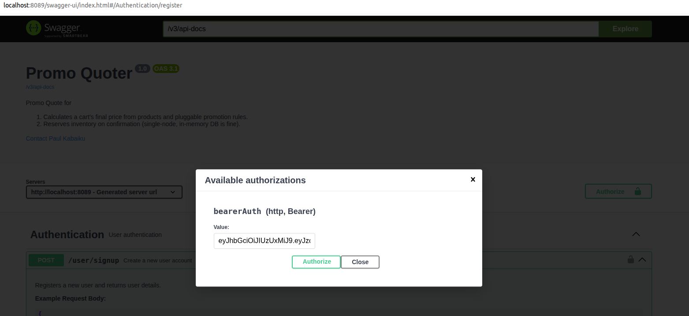

# PromoQuoter

**Cart Pricing & Reservation Microservice** — A Spring Boot microservice for managing shopping cart pricing and product reservations with JWT authentication.

## Prerequisites

Ensure you have the following installed:

- [**Java 21**](https://www.oracle.com/java/technologies/javase/jdk21-archive-downloads.html)
- [**Maven 3.8+**](https://maven.apache.org/download.cgi)
- [**Docker**](https://www.docker.com/get-started)
- [**Docker Compose**](https://docs.docker.com/compose/install/)
- [**kubectl**](https://kubernetes.io/docs/tasks/tools/)

## Quick Start

**Clone the repository**
   ```bash
   git clone <repository-url>
   cd promoquoter
   ```

## Database Configuration

PromoQuoter supports both H2 (in-memory) and MySQL databases. Configure your preferred database in `application.yml`:

### H2 Database (Default - Development)
```application-h2.yml
spring:
  profiles:
    active: h2
```

### MySQL Database
```application-mysql.yml
spring:
  profiles:
    active: mysql
  datasource:
    url: jdbc:mysql://your-host:your-port/your-database-name?createDatabaseIfNotExist=true
    username: your-username
    password: your-password
    driver-class-name: com.mysql.cj.jdbc.Driver
```

**Note**: Update the MySQL credentials according to your environment.

## Running the Application

### Option 1: IDE
Open the project in your preferred IDE (IntelliJ IDEA, Eclipse, VS Code, Spring Tool Suite) and run the main application class.

### Option 2: Maven
```bash
mvn spring-boot:run
```

### Option 3: Docker Compose
```bash
# Start service
docker-compose up -d

# View logs
docker-compose logs -f

# Stop service
docker-compose down
```

### Option 4: Standalone JAR
```bash
# Build JAR
mvn clean package

# Run JAR
java -jar target/promoquoter-*.jar
```

## Kubernetes Deployment

### Prerequisites for Kubernetes
- Kubernetes cluster (minikube, kind, or cloud provider)
- kubectl configured to connect to your cluster

### Step 2: Build and Deploy

1. **Build Docker Image**
   ```bash
   # Build the image
   docker compose build

   # If using minikube, load image into minikube
   minikube image load promoquoter:latest
   ```

2. **Deploy to Kubernetes**
   ```bash
   # Apply all manifests
   kubectl apply -f k8s/

   # Or apply individually
   kubectl apply -f service.yaml
   kubectl apply -f deployment.yaml
   kubectl apply -f hpa.yaml
   ```

3. **Verify Deployment**
   ```bash
   # Check pods
   kubectl get pods -n promoquoter

   # Check services
   kubectl get svc -n promoquoter

   # View logs
   kubectl logs -f deployment/promoquoter-app -n promoquoter
   ```

4. **Access the Application**
   ```bash
   # Port forward to access locally
   kubectl port-forward svc/promoquoter-service 8080:80 -n promoquoter

   # Access at: http://localhost:8080/swagger-ui
   ```

## API Documentation

PromoQuoter uses JWT (JSON Web Token) for authentication:

## 1. Create Account

- Open in your favourite browser: [**Swagger UI**](http://localhost:8089/swagger-ui/index.html)
- Use the `/user/signup` endpoint to create a user.

## 2. Login to get JWT token

- Open in your favourite browser: [**Swagger UI**](http://localhost:8089/swagger-ui/index.html)
- Use the `/user/login` endpoint to log in and get the token.


## 3. **Use the token in subsequent requests**
   ```bash
   Set the token as below and use it in subsequent requests 
   ```


### Running Tests
```bash
# Run all tests
mvn test

# Run integration tests
mvn integration-test

# Generate test reports
mvn surefire-report:report
```

### Code Quality
```bash
# Check code style
mvn checkstyle:check

# Run static analysis
mvn spotbugs:check

# Generate coverage report
mvn jacoco:report
```
